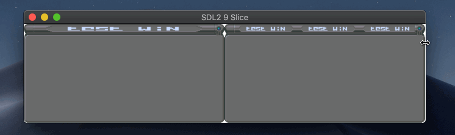

# sdl2-9-slice
9-slice demo, using SDL2 to render a scaled image.

Left: resize; right: repeat

[ui.png](https://opengameart.org/content/unfinished-user-interfaces) by [Buch](https://opengameart.org/users/buch)
http://creativecommons.org/publicdomain/zero/1.0/
